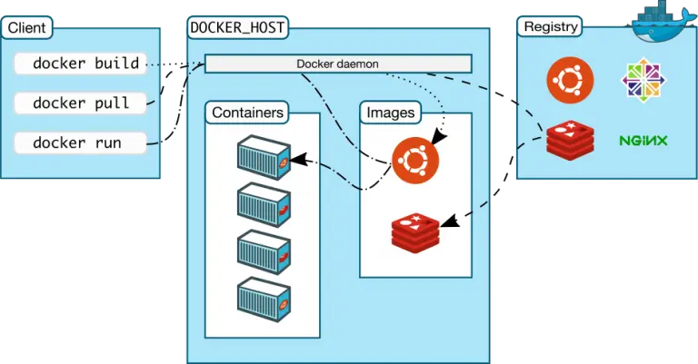
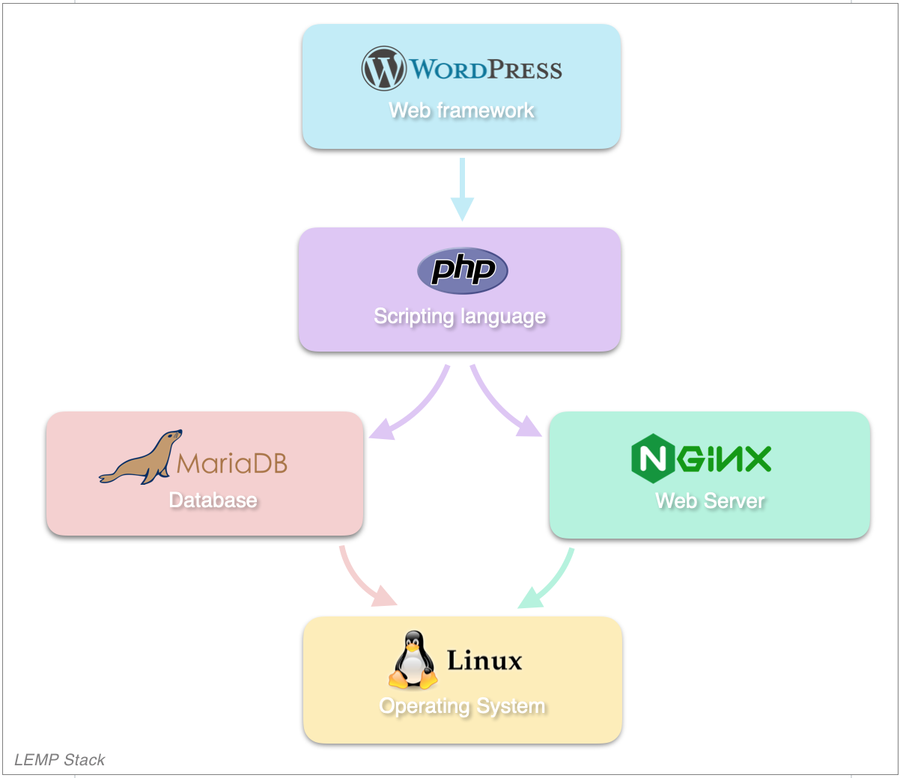
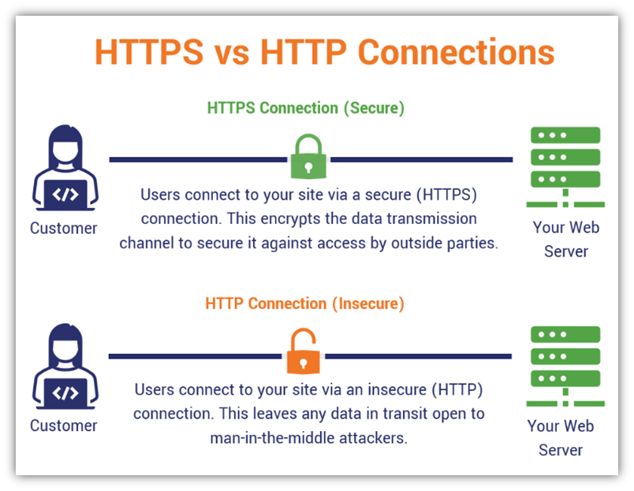
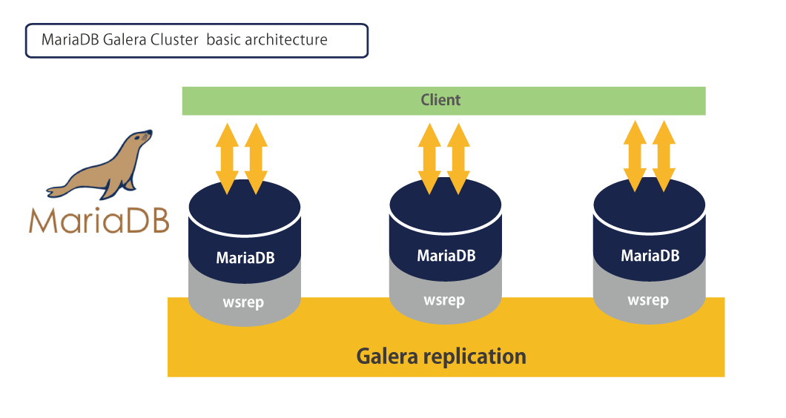
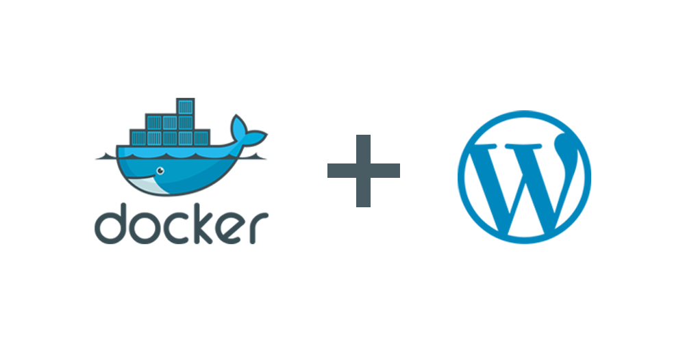
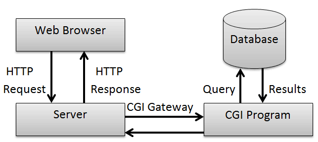
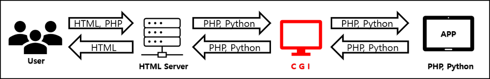

# Inception (42 Projesi)
## Açıklama

Alpine Linux veya Debian Buster üzerinde docker-compose kullanarak Docker tabanlı bir WordPress LEMP yığını oluşturma.


## İçindekiler

* [Açıklama](#açıklama)
* [DOCKER](#docker)
    * [DOCKER NEDİR?](#docker-nedir)
    * [KONTEYNERLER VE İMAGELER](#konteynerler-ve-imageler)
    * [DOCKER NASIL ÇALIŞIR?](#docker-nasıl-çalışır)
    * [DOCKERFILES](#dockerfiles)
    * [KATMANLAR](#katmanlar)
* [DOCKER COMPOSE](#docker-compose)
* [DOCKER VS DOCKER COMPOSE](#docker-vs-docker-compose)
* [DOCKER VS SANAL MAKİNE](#docker-vs-sanal-makine)
* [DOCKER AĞ YAPILANDIRMASI](#docker-ağ-yapılandırması)
* [♻️ LEMP YIĞINI](#lemp-yığını)
    * [NGINX](#nginx)
    * [MARIADB](#mariadb)
    * [WORDPRESS](#wordpress)
* [Proje Akış Şeması](#proje-akış-şeması)
* [Kurulum](#kurulum)
* [Kaynaklar](#kaynaklar)

# Docker
## Docker Nedir?
Docker, Dotcloud (Bir PaaS Şirketi) tarafından Go dilinde geliştirilmiş popüler bir açık kaynak projesidir.

Linux Kernel özelliklerini (isim alanları ve kontrol grupları gibi) kullanarak bir işletim sistemi üzerinde konteynerler oluşturan bir konteyner motorudur. Bu nedenle buna OS seviyesinde sanallaştırma denebilir.

Docker, konteynerler kullanarak uygulamaları kurmak ve dağıtmak için kullanılır. Docker ortamı, uygulama geliştirme yaşam döngüsünü kolaylaştırır ve gelişmiş bir Docker aracı olan Docker Compose, iş akışınızı basitleştirmek için kullanılabilir.

## Konteynerler ve Imageler
Docker'ın temel yapısı imageler ve konteynerler üzerine kuruludur. Bir konteyneri nesne, imajı ise sınıfı olarak düşünebiliriz.

Konteyner, belirli bir uygulamayı çalıştırmak için gereken her şeyi içeren izole bir sistemdir. Gerekli ortamı simüle eden bir imajın belirli bir örneğidir. Ubuntu Docker konteynerını çalıştırıp bash kabuğuna erişmek için örnek komut:
docker run -i -t ubuntu /bin/bash

Imageler ise konteynerları başlatmak için kullanılır. Çalışan konteynerlerden imageler alabiliriz. Bunlar, uygulamaları paketlemenin sistemden bağımsız bir yolunu oluşturmak için bir araya getirilebilir.

Imageler önceden oluşturulmuş olabilir, kayıt defterlerinden alınabilir, mevcut olanlardan oluşturulabilir veya ortak bir ağ üzerinden birleştirilebilir.

## Docker Nasıl Çalışır?
### Docker Bileşenleri:
<p align="center">
    
</p>

Docker ekosistemi şu dört bileşenden oluşur:

1. Docker Daemon (dockerd)
2. Docker İstemcisi
3. Docker Imageleri
4. Docker Kayıt Defterleri
5. Docker Konteynerları

### Docker Daemon Nedir?
Docker istemci-sunucu mimarisine sahiptir. Docker Daemon (dockerd) veya sunucusu, konteynerlerle ilgili tüm eylemlerden sorumludur.

Daemon, Docker istemcisinden komutları CLI veya REST API aracılığıyla alır. Docker istemcisi, daemon ile aynı ana bilgisayarda veya başka bir ana bilgisayarda bulunabilir.

Varsayılan olarak, docker daemon docker.sock UNIX soketini dinler. Docker API'sine uzaktan erişmek için herhangi bir kullanım durumunuz varsa, bunu bir ana bilgisayar portu üzerinden açmanız gerekir. Jenkins ajanları olarak Docker çalıştırmak böyle bir kullanım durumudur.

Docker içinde Docker çalıştırmak istiyorsanız, ana makinedeki docker.sock'u kullanabilirsiniz.

### Docker İstemcisi Nedir?
Docker istemcisi, kullanıcıların bir Docker daemon'ına uygulama komutlarını çalıştırmasına ve durdurmasına olanak tanıyan bir komut satırı arayüzü (CLI) sağlar.

### Docker Kayıt Defteri Nedir?
Docker imageleri için bir depodur.

Kayıt defteri genel veya özel olabilir. Örneğin, Docker Inc., Docker Hub adında barındırılan bir kayıt defteri hizmeti sağlar. Bu, merkezi bir konumdan imageleri yüklemenize ve indirmenize olanak tanır.

## Dockerfiles
Dockerfiles, uygulamamızı nasıl konteynerize ettiğimiz veya önceden oluşturulmuş bir imajdan yeni bir konteyner oluşturup uygulamamızı başlatmak için özel mantık eklediğimizdir. Bir Dockerfile'dan, bir imaj oluşturmak için Docker build komutunu kullanırız.

Bir Dockerfile'ı, bir imaj oluşturmak için komut satırında çağırdığımız komutları içeren bir metin belgesi olarak düşünün.

Aşağıda bir Dockerfile örneği verilmiştir:
FROM python:3

WORKDIR /usr/src/app

COPY requirements.txt ./
RUN pip install --no-cache-dir -r requirements.txt

COPY . .

CMD [ "python", "./your-daemon-or-script.py" ]

## Katmanlar
Bir Dockerfile katmanlar halinde çalışır. Bunlar Docker'ın yapı taşlarıdır. İlk katman, `FROM` anahtar kelimesiyle başlar ve hangi önceden oluşturulmuş imajı kullanarak bir imaj oluşturacağımızı tanımlar. Daha sonra kullanıcı izinlerini ve başlangıç komut dosyalarını tanımlayabiliriz.

Docker'da, bir konteyner salt okunur bir katmanın üzerine inşa edilmiş, salt okunur bir katman olan bir imajdır. Bu katmanlara ara imageler denir ve bunlar, oluşturma aşamasında Dockerfile'ımızdaki komutları yürüttüğümüzde oluşturulur.

## Docker Compose
**Docker Compose**: Çoklu konteyner uygulamalarını tanımlamak ve çalıştırmak için kullanılan bir Docker aracıdır. Compose ile, uygulamanızın hizmetlerini yapılandırmak ve uygulamanın tüm hizmetlerini bu yapılandırmadan oluşturmak için bir YAML dosyası kullanırsınız.

docker-compose'u otomatikleştirilmiş çoklu konteyner iş akışı olarak düşünün. Compose, geliştirme, test, CI iş akışları ve hazırlık ortamları için mükemmel bir araçtır. Docker belgelerine göre, Docker Compose'un en popüler özellikleri şunlardır:

- Tek bir ana bilgisayarda birden çok izole ortam
- Konteynerler oluşturulurken birim verilerini koruma
- Yalnızca değişen konteynerleri yeniden oluşturma
- Değişkenler ve bir kompozisyonu ortamlar arasında taşıma
- Birlikte çalışan birden çok konteyneri düzenleme

## Docker vs Docker Compose
Daha önce tartıştığımız gibi, bir Dockerfile, bir Docker imajı oluşturmak için talimatları içeren bir komut dosyasıdır. Kullanılacak temel imajı, çalıştırılacak komutları ve imaja kopyalanacak dosyaları belirtir. Bir Dockerfile oluşturduktan sonra, bir imaj oluşturmak için `docker build` komutunu kullanabilirsiniz, daha sonra bu imaj bir konteyner olarak çalıştırılır.

Bu arada, Docker Compose, çoklu konteyner Docker uygulamalarını tanımlamak ve çalıştırmak için kullandığımız araçtır. Uygulamanızı oluşturan hizmetleri, yapılandırmalarını ve bağımlılıklarını `docker-compose.yml` adlı tek bir dosyada tanımlamak için kullanabilirsiniz.

Dockerfiles ve Docker Compose farklı roller oynar, ancak DevOps iş akışınızı kolaylaştırmaya yardımcı olmak için uyum içinde çalışır.

Docker metodolojisi, oluşturmanız gereken her imaj için uygun bir Dockerfile yazmak, ardından imageleri `build` komutunu kullanarak gruplamak için Docker Compose'u kullanmaktır.

## Docker vs Sanal Makine
Hem sanal makineler hem de konteynerler, geliştirme ortamını çoğaltmaya ve bağımlılıkları ile yapılandırmaları daha iyi yönetmeye yardımcı olur. Ancak, uygulamaya bağlı olarak bir VM veya Docker konteynerı seçmenize yardımcı olacak bazı farklılıkların farkında olmalısınız.

### 1️⃣ Sanallaştırma
Şimdiye kadar anladığımız kadarıyla, hem sanal makineler hem de Docker konteynerları uygulamaları çalıştırmak için izole ortamlar sağlar. İkisi arasındaki temel fark, bu izolasyonu nasıl sağladıklarında yatar.
Bir VM'nin kendi konuk işletim sistemini başlattığını hatırlayın. Bu nedenle hem işletim sistemi çekirdeğini hem de uygulama katmanını sanallaştırır.
Bir Docker konteyneri yalnızca uygulama katmanını sanallaştırır ve ana bilgisayar işletim sisteminin üzerinde çalışır.

<p align="center">
    
</p>

### 2️⃣ Uyumluluk
Sanal makine kendi işletim sistemini kullanır ve üzerinde çalıştığı ana bilgisayar işletim sisteminden bağımsızdır. Bu nedenle, bir VM tüm işletim sistemleriyle uyumludur.

Bir Docker konteyneri ise herhangi bir Linux dağıtımıyla uyumludur. Docker'ı bir Windows makinesinde veya eski bir Mac'te çalıştırırken bazı sorunlarla karşılaşabilirsiniz.

### 3️⃣ Boyut
Bir Docker imajı hafiftir ve tipik olarak kilobayt mertebesindedir.

💡 Not: Bir Docker imajı, uygulamayı, ilişkili bağımlılıklarını ve yapılandırmasını içeren yapıyı belirtir. Docker imajının çalışan bir örneğine konteyner denir.

Bir VM örneği birkaç gigabayt hatta terabayt kadar büyük olabilir.

### 4️⃣ Performans
Performans açısından, Docker konteynerları yerel performansa yakın performans sağlar. Hafif oldukları için bunları birkaç milisaniye içinde başlatabilirsiniz.

Bir VM başlatmak, bilgisayarınızın içinde bağımsız bir makine kurmaya eşdeğerdir. Bir VM örneğini başlatmak birkaç dakika kadar sürebilir.

### 5️⃣ Güvenlik
Docker konteynerları ana bilgisayar işletim sisteminin üzerinde çalışır. Bu nedenle, ana bilgisayar işletim sistemi güvenlik açıklarına karşı hassassa, Docker konteynerları da hassastır.

Sanal makineler ise kendi işletim sistemlerini başlatır ve daha güvenlidir. Hatırlayın: her sanal makine, başka birinin içinde çalışan tam teşekküllü bir makinedir. Hassas uygulamalar için karşılanması gereken katı güvenlik kısıtlamalarınız varsa, bunun yerine bir sanal makine kullanmayı düşünmelisiniz.

### 6️⃣ Çoğaltılabilirlik
Şimdi ele alacağımız bir sonraki faktör, VM'ler ve konteynerler tarafından sağlanan izole ortamları çoğaltmanın kolaylığıdır. Çoğaltılabilirliğin kolaylığını boyut ve performans hakkındaki önceki tartışmalarımızdan çıkarabiliriz.

Her biri bir VM örneğinde çalışması gereken birden çok uygulama olduğunda, VM kullanmak verimsiz ve kaynak yoğun olabilir. Docker konteynerları, hafif ve performanslı olmaları sayesinde, birden çok uygulama çalıştırmanız gerektiğinde tercih edilir. ✅

daha fazla bilgi için: [Docker vs Sanal Makine (VM) - Bilmeniz Gereken Temel Farklar](https://www.freecodecamp.org/news/docker-vs-vm-key-differences-you-should-know/)<br>

## Docker Ağ Yapılandırması
[Docker Ağ Yapılandırması - Konteynerlerin Birbirleriyle Nasıl İletişim Kurduğunu Keşfedin](https://medium.com/edureka/docker-networking-1a7d65e89013)<br>
[Docker Ağları — Bölüm(1/2)](https://faun.pub/docker-networks-part-1-of-2-15a986a48d0a)<br>
[Docker Ağları — Bölüm(2/2)](https://faun.pub/docker-networks-part-2-of-2-8eaca9308456)<br>

## LEMP Yığını
### 🤔 LEMP Yığını Nedir?
Konu, bir LEMP yığını oluşturmamızı istiyor:
- L, işletim sistemi olarak **Linux** anlamına gelir
- E, web sunucusu olarak **Nginx**
- M, veritabanı olarak **Mariadb**
- P, sunucu ve veritabanıyla iletişim kuran sunucu tarafı komut dosyası dili olarak **PHP**
Yığının her bileşeni birbiriyle iletişim kurar:
<p align="center">
    
</p>

## Nginx
<h3> 🔐 SSL / TLS </h3>
**Sunucu sertifikası** herkese açık bir varlıktır. Sunucuya bağlanan her istemciye gönderilir.

**Özel anahtar** güvenli bir varlıktır ve kısıtlı erişimi olan bir dosyada saklanmalıdır, ancak nginx'in ana süreci tarafından okunabilir olmalıdır.



<p> <br/> <p/>

    - HTTP  : Hiper Metin Transfer Protokolü

    - HTTPS : HTTP Secure (HTTPS) = TLS/SSL üzerinden HTTP

    - SSL   : Secure Sockets Layer

    - TLS   : Taşıma Katmanı Güvenliği = SSL'in halefi

<p align="center">
    <br/> <br/> <br/>
    
    <br/> <br/>
</p>

## Mariadb
<p>
    <br/>
    MariaDB Sunucusu, veritabanlarını ve tabloları içeren MariaDB veri dizinine erişimi yönetir. MariaDB sunucusu başladığında, istemci programlarından gelen ağ bağlantılarını dinler ve bu istemciler adına veritabanlarına erişimi yönetir.

***mysqld*** asıl MariaDB Sunucu ikili dosyasıdır.

***mysqld_safe*** Unix'te bir mysqld sunucusu başlatmanın önerilen yoludur. mysqld_safe, bir hata oluştuğunda sunucuyu yeniden başlatma ve çalışma zamanı bilgilerini bir hata günlük dosyasına kaydetme gibi bazı güvenlik özellikleri ekler.

***mysql_install_db*** MariaDB veri dizinini başlatır ve mysql veritabanındaki sistem tablolarını (eğer yoksa) oluşturur.
</p>

<p align="center">
    <br/> <br/> <br/>
    
    <br/> <br/>
</p>

## Wordpress
<p align="center">
<br/> <br/> <br/>

    <br/> <br/>
</p>

### PHP-FPM
PHP işlemeyi doğrudan kendi başına halledebilen Apache'nin aksine, Nginx bir PHP komut dosyasını nasıl çalıştıracağını bilmez. PHP isteklerini işlemek için PHP-FPM gibi ayrı bir PHP işlemcisine güvenmelidir.

PHP-FPM bir PHP-FastCGI Süreç Yöneticisidir. Bir PHP dili yorumlayıcısıdır ve php isteklerini yönetir.

Nginx sunucusu yalnızca HTTP isteklerini işleyecek, PHP-FPM hizmeti ise PHP kodunu yorumlayacaktır. Bir kullanıcı bir PHP sayfası istediğinde, Nginx sunucusu isteği FastCGI protokolünü kullanarak PHP-FPM hizmetine iletecektir. PHP-FPM, kendi sürecini oluşturarak Nginx ortamının dışında çalışır.

PHP-FPM Unix soketlerini veya TCP soketlerini (burada kullandığımız) dinleyebilir.

### CGI ve FastCGI
#### Ortak Ağ Geçidi Arayüzü (CGI)
<br/> <br/> <br/>

<br/> <br/>
</p>

Günümüzde bir web sitesine bakarsanız, yalnızca HTML belgeleri olan bir sunucu siteyi çalıştıramaz. HTML dosya yönetimi, yüksek hızlı veri işleme, kullanıcı tarafından girilen verilerin depolanması vb. statik HTML dosyalarını işleyen bir web sunucusuyla imkansızdı ve böylece CGI ortaya çıktı.

CGI, bu web sunucuları (Nginx, Apache) ile PHP ve Python arasında, standartlaştırılmış sözlerle birbirlerine veri iletmek ve işlemek için vardır.

<br/> <br/> <br/>

<br/> <br/>
</p>
Bu CGI'da, kullanıcı tarafından istenen bilgi statik bir HTML dosyası değilse, ancak PHP veya Python'dan bir istek gelirse, web sunucusu bunu işleyemeyeceğini bilir ve geliştirici tarafından yazılan PHP komut dosyasını okuması ve işlemesi için PHP yorumlayıcısına istekte bulunur. Sonuç web sunucusuna döndürülür, o da tarayıcıya döndürür.

### CGI'nın Sınırlamaları
Hizmetler giderek büyüdükçe, CGI da sınırlarına ulaşıyor.

CGI, her istendiğinde bir işlem oluşturur ve işlem çalışırken sistem kaynaklarını tüketir. Ayrıca, aynı anda çok sayıda istek oluşursa, işlem oluşturulur ve sunucu üzerinde bir yük oluşturur.

### Hızlı Ortak Ağ Geçidi Arayüzü (FastCGI)
CGI'nın yük problemi nedeniyle sunucu üzerinde verimsizdi. Bir çözüm olarak FastCGI, CGI'nın evrim geçirmiş halidir. 20 yılı aşkın süredir standarttır ve çoğu web sunucusu (Nginx, IIS, Apache) FastCGI işlevi sağlar.

FastCGI, mevcut CGI gibi her istek için bir işlem oluşturmak yerine, tek bir büyük işlem oluşturarak birden çok isteği işler.

Ayrıca, FastCGI ile soket iletişimi aracılığıyla arka uçta bir PHP sunucusu kurarak web sunucusunu ve PHP'yi ayırmak mümkündür. Buna WAS (Web Uygulama Sunucusu) denir.

## Proje Akış Şeması
<br/> <br/> <br/>

<br/> <br/>
</p>

## Kurulum
1. Proje klasörünü klonlayın:
    ```
    git clone https://github.com/e-kose/__docker__.git
    ```

2. Klasöre gidin:
    ```
    cd inception
    ```

3. Imageleri oluşturun ve altyapıyı dağıtın:
    ```
    make
    ```

4. Konteynerları, imageleri, birimleri ve ağı durdurun ve kaldırın:
    ```
    make clean
    ```

# Kaynaklar
- [Docker Nedir? Nasıl Çalışır?](https://devopscube.com/what-is-docker/)<br>
- [Cgroups, namespaces, and beyond: Konteynerler nelerden oluşur?](https://www.youtube.com/watch?v=sK5i-N34im8&ab_channel=Docker)<br>
- [Konteynerler vs. Sanal Makineler](https://blogs.umass.edu/Techbytes/2018/10/09/what-is-docker-and-how-does-it-work/)<br>
- [Yeni Başlayanlar İçin Docker Eğitimi](https://www.youtube.com/watch?v=zJ6WbK9zFpI&ab_channel=KodeKloud)<br>
- [Docker Ağ Kavramlarını Açıklama](https://ostechnix.com/explaining-docker-networking-concepts/)<br>
- [Örneklerle Dockerfile eğitimi - temeller ve en iyi uygulamalar](https://takacsmark.com/dockerfile-tutorial-by-example-dockerfile-best-practices-2018)
- [Docker ağı ÇILGINCA!!!](https://www.youtube.com/watch?v=bKFMS5C4CG0&ab_channel=NetworkChuck)<br>
- [Docker Konteynerları Arasında Nasıl İletişim Kurulur](https://www.tutorialworks.com/container-networking/)<br>
- [Docker Compose Kullanarak NGINX, PHP-FPM ve MariaDB ile WordPress Dağıtımı](https://medium.com/swlh/wordpress-deployment-with-nginx-php-fpm-and-mariadb-using-docker-compose-55f59e5c1a)
- [Nginx'i Yalnızca TLS 1.2 / 1.3 Kullanacak Şekilde Yapılandırma](https://www.cyberciti.biz/faq/configure-nginx-to-use-only-tls-1-2-and-1-3/)
- [MariaDB Nasıl Kurulur](https://www.digitalocean.com/community/tutorials/how-to-install-mariadb-on-ubuntu-20-04)
- [wp-cli Kullanarak WordPress Nasıl Kurulur](https://blog.sucuri.net/2022/11/wp-cli-how-to-install-wordpress-via-ssh.html)
- [CGI ve FastCGI Öğrenin](https://www.howtoforge.com/install-adminer-database-management-tool-on-debian-10/)
- [adminer kurulumu](https://www.howtoforge.com/install-adminer-database-management-tool-on-debian-10/)
